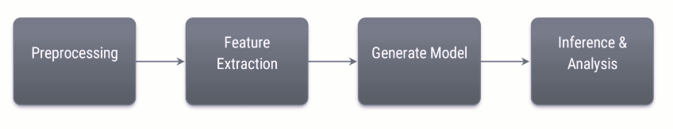

# A writer identifier implementation that uses randomly generated training and test data from the IAM dataset

## Project Pipeline

This project adopts the following machine learning pipeline:

## Preprocessing

Input images are processed according to the chosen features extraction method, but whatever the chosen extraction method is, the image essentially goes through the same procedures. The preprocessing module simply crops the image to its useful content (i.e the handwritten text corpus) and returns a binarized version of the cropped image and a grayscale version depending on the type of the features extraction method.

## Features Extraction

The features extraction phase is inspired by [this paper](https://www.sciencedirect.com/science/article/abs/pii/S0045790617322401). Two similar methods are implemented for extracting features from raw images. The first is implemented as proposed in the paper where the image is segmented into words images which are then overlapped into a single image to represent the texture of a particular writer’s handwriting. Texture images are then segmented into texture blocks that are each represented as an input vector for the next phase using their local binary pattern histograms.

The other feature extraction method works by simply feeding the model in the next phase raw segmented images (e.g sentences, words) of the cropped image. Despite being simple, this method takes much more time to execute than the overlapping method mentioned above as it takes an average execution time of 10 seconds per iteration while the overlapping method takes around 3.5 seconds per iteration, in addition to that, the overlapping method yields better accuracy by a slight yet accountable margin making matter disadvantageous for the lines method.

## Model Generation

The output of the previous step is feed to a model generator function that’s responsible for both generating and training a model. You can either choose a support vector machine classifier or a neural network classifier to classify test images. Both yield exceptional results when running on 1000 random samples, the neural network classifier has a slight edge over the SVM classifier in terms of accuracy as it achieves 98.8% accuracy compared to 98.2%. On the other side of the coin, the SVM classifier is faster than the neural network one having an average iteration runtime of 3.4 seconds instead of 14.7 seconds but keep in mind that neural network classifiers performance can be improved by GPU acceleration which indeed reduced the neural network classifier average iteration runtime from 14.7 seconds to 8.7 seconds.

## Training and Test Samples Generation

At each epoch, 3 random writers directories are chosen from the dataset where 2 random images are read from each writer's directory and an extra image to be used for testing is randomly chosen from the three writers' directories. This process ends up with 7 labelled images, 6 for training (2 for each writer) and 1 for testing.
